<div align="center">

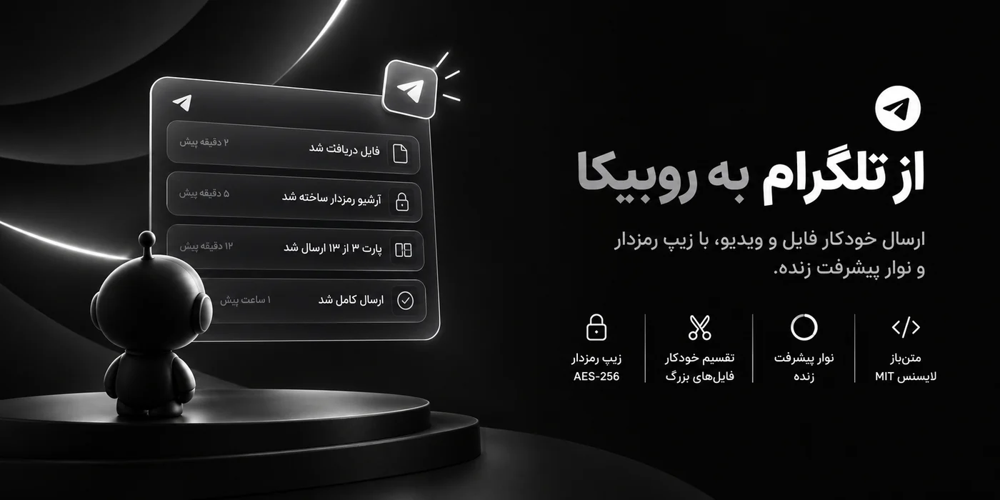

<p>
  
  
  
  
  
  <a href="./LICENSE"></a>
</p>

<p>
  <a href="#how">چطور کار می‌کنه</a> ·
  <a href="#features">امکانات</a> ·
  <a href="#demo">دمو</a> ·
  <a href="#links">دانلود از لینک</a> ·
  <a href="#modes">حالت‌های ارسال</a> ·
  <a href="#security">امنیت</a> ·
  <a href="#recovery">بازیابی</a> ·
  <a href="#stats">آمار</a> ·
  <a href="#install">نصب</a> ·
  <a href="#architecture">معماری</a> ·
  <a href="#help">عیب‌یابی</a>
</p>

</div>

<div dir="rtl">

یک یوزربات پیشرفته که **فایل‌ها رو از تلگرام می‌گیره و خودکار به روبیکا می‌فرسته**. از لینک مستقیم و پلتفرم‌های ویدیویی مثل یوتیوب، اینستاگرام و تیک‌تاک هم دانلود می‌کنه، فایل‌های بزرگ رو تکه‌تکه می‌کنه و اگه بخوای با رمز AES-256 محافظتشون می‌کنه.

---

<a id="how"></a>

## 🧭 چطور کار می‌کنه

<p align="center">
  
</p>

۱. **بفرست:** فایل یا لینک رو برای ربات بفرست. چند فایل رو هم می‌تونی پشت‌سر‌هم فوروارد کنی؛ ربات ۵ ثانیه صبر می‌کنه تا همه رو جمع کنه.

۲. **دانلود:** ربات دانلود می‌کنه و درصد، سرعت و حجم رو زنده نشون می‌ده.

۳. **انتخاب حالت:** معمولی، زیپ یا زیپ + رمز.

۴. **دریافت:** فایل‌ها توی «پیام‌های ذخیره‌شده»ی روبیکات می‌رسن؛ با کپشن تاریخ شمسی (و رمز و شماره‌ی پارت، اگه لازم باشه).

---

<a id="features"></a>

## ✨ امکانات

<p align="center">
  
</p>

| | امکان | توضیح |
|:-:|---|---|
| 📥 | **دریافت فایل از تلگرام** | فایل رو به ربات بده تا مستقیم به روبیکات برسه؛ حتی بالای ۲۰MB (بدون محدودیت Bot API) |
| 🔗 | **دانلود از لینک** | یوتیوب، اینستاگرام، توییتر/X، تیک‌تاک، فیسبوک و لینک مستقیم |
| 🎞️ | **انتخاب کیفیت** | برای سایت‌های ویدیویی: بهترین کیفیت، 1080p، 720p، 360p یا فقط صدا |
| 📦 | **ارسال فشرده** | معمولی، زیپ (7z) یا زیپ رمزدار |
| ✂️ | **تقسیم فایل‌های بزرگ** | از ۱۰۰MB به بالا، خودکار به پارت‌های 95MB تقسیم می‌شه |
| 📊 | **نوار پیشرفت زنده** | درصد، سرعت و حجم، هم موقع دانلود هم موقع ارسال |
| 🗓️ | **تاریخ شمسی** | کپشن فایل‌ها با تاریخ و ساعت فارسی |
| 🔒 | **دسترسی محدود** | فقط یک کاربر مشخص (خودت) می‌تونه استفاده کنه |
| 📈 | **آمار** | گزارش دانلودها، ارسال‌ها و آرشیوها |
| 🔄 | **بازیابی بعد از ری‌استارت** | اگه ربات کرش کنه یا سرور ری‌استارت بشه، کار نیمه‌کاره و پیشرفت ارسال از دست نمی‌ره |

---

<a id="demo"></a>

## 🎬 دمو

<table align="center">
  <tr>
    <td align="center" width="50%">
      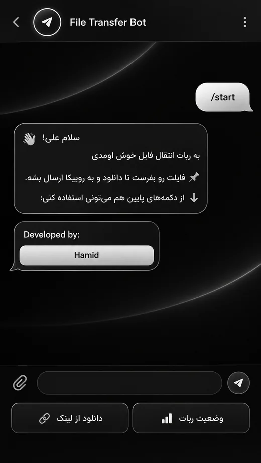<br>
      <sub><b>شروع</b> — با <code>/start</code> دکمه‌های اصلی میاد</sub>
    </td>
    <td align="center" width="50%">
      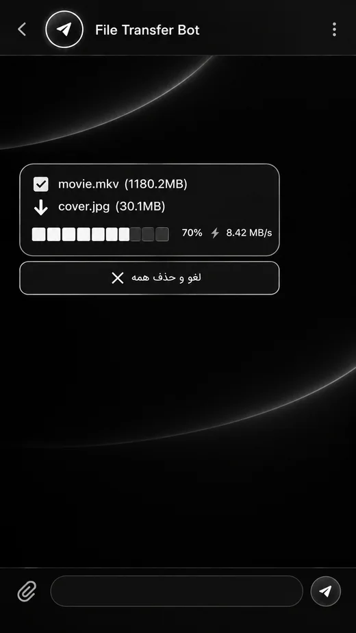<br>
      <sub><b>دانلود</b> — نوار پیشرفت زنده برای هر فایل</sub>
    </td>
  </tr>
</table>

---

<a id="links"></a>

## 🔗 دانلود از لینک

<p align="center">
  
</p>

<p align="center">
  
  
  
  
  
  
</p>

دکمه‌ی **«🔗 دانلود از لینک»** رو بزن و لینک رو بفرست. ربات خودش تشخیص می‌ده چه نوعیه:

- **لینک مستقیم فایل:** فوراً دانلود می‌شه (تا سقف `MAX_SIZE_MB`).
- **صفحه‌ی ویدیو:** اطلاعات ویدیو (عنوان و مدت) با `yt-dlp` خونده می‌شه و لیست کیفیت‌ها با حجم تقریبی میاد؛ یکی رو انتخاب کن.

<table align="center">
  <tr>
    <td align="center">
      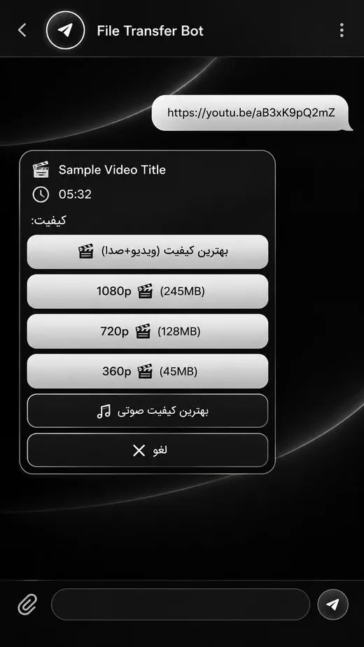<br>
      <sub>لینک رو بفرست، کیفیت رو انتخاب کن</sub>
    </td>
  </tr>
</table>

---

<a id="modes"></a>

## 📦 حالت‌های ارسال و تقسیم فایل

<p align="center">
  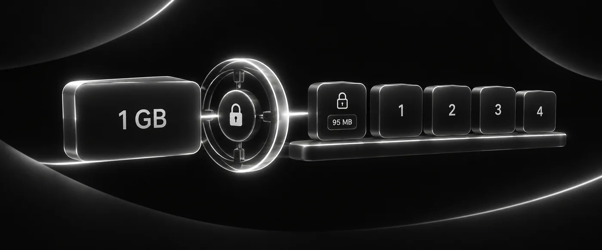
</p>

بعد از این‌که فایل‌ها آماده شدن، ربات می‌پرسه چطور بفرسته:

| حالت | چی می‌شه | رمز | تقسیم به پارت |
|---|---|:-:|:-:|
| 📎 **معمولی** | هر فایل جدا و دست‌نخورده فرستاده می‌شه | ❌ | ❌ |
| 🗜 **زیپ** | همه‌ی فایل‌ها توی یک آرشیو 7z بسته می‌شن | ❌ | ✅ (از ۱۰۰MB به بالا) |
| 🛡 **زیپ + رمز** | آرشیو 7z با رمزنگاری AES-256 | ✅ (رندوم، ۱۴ کاراکتر) | ✅ (از ۱۰۰MB به بالا) |

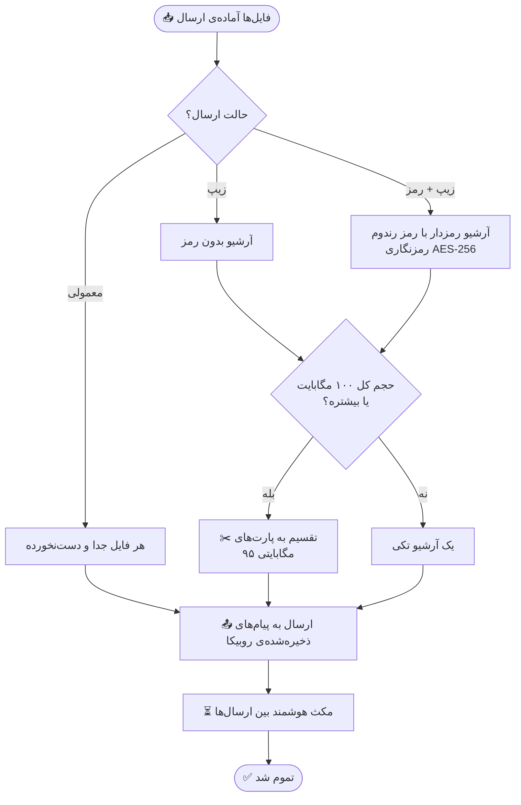

<table align="center">
  <tr>
    <td align="center" width="33%">
      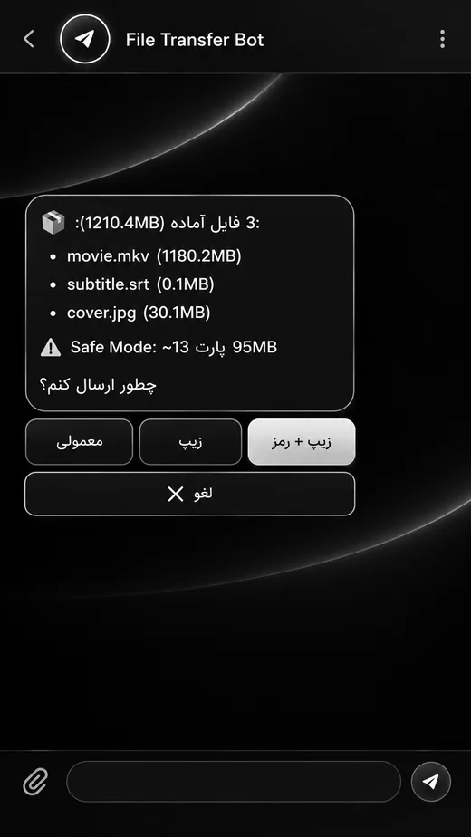<br>
      <sub><b>انتخاب حالت</b></sub>
    </td>
    <td align="center" width="33%">
      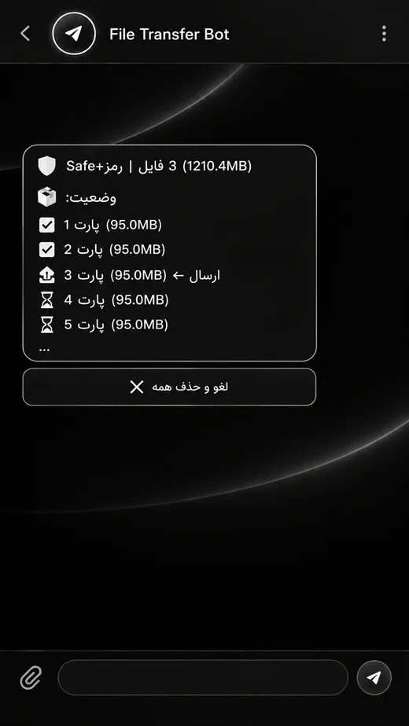<br>
      <sub><b>ارسال پارت به پارت</b></sub>
    </td>
    <td align="center" width="33%">
      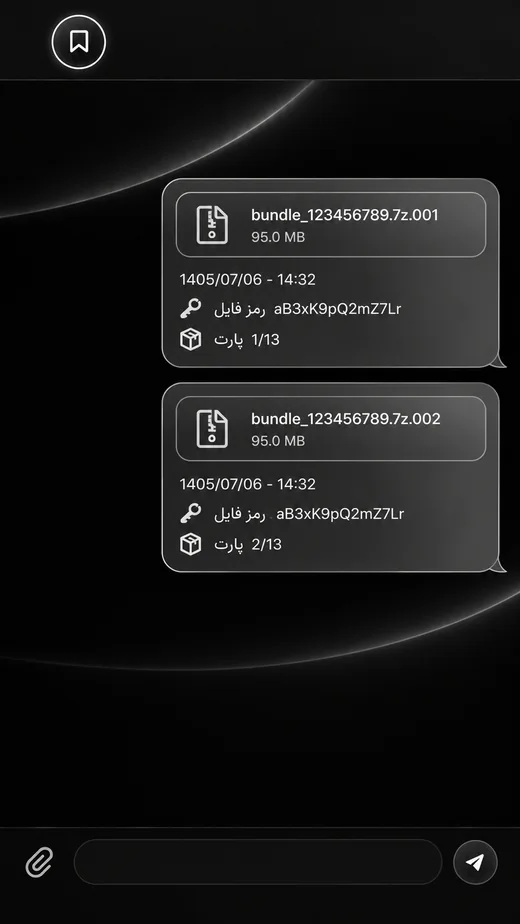<br>
      <sub><b>نتیجه توی روبیکا</b></sub>
    </td>
  </tr>
</table>

> 💡 **باز کردن پارت‌ها:** همه‌ی پارت‌ها (‎`.7z.001`، ‎`.7z.002`، ...) رو توی یک پوشه بذار و فقط فایل ‎`.001` رو با [‎7-Zip‎](https://www.7-zip.org/) باز کن. رمز توی کپشن پیام روبیکا هست.

<details>
<summary><b>⏱️ مکث هوشمند و تلاش مجدد</b></summary>

<br>

بین ارسال هر فایل/پارت، ربات بر اساس حجم فایل بعدی مکث می‌کنه تا روبیکا محدودت نکنه:

| حجم فایل | مکث |
|:-:|:-:|
| کمتر از 10MB | 10 ثانیه |
| 10 تا 50MB | 30 ثانیه |
| 50 تا 100MB | 60 ثانیه |
| بالای 100MB | 120 ثانیه |

اگه ارسال یه فایل یا پارت خطا بده، ربات هر ۳۰ ثانیه دوباره تلاش می‌کنه (تا ۱۵ بار). هر لحظه هم می‌تونی با دکمه‌ی **❌ لغو و حذف همه** همه‌چی رو متوقف کنی و فایل‌ها از سرور پاک بشن.

</details>

---

<a id="security"></a>

## 🔒 امنیت

<p align="center">
  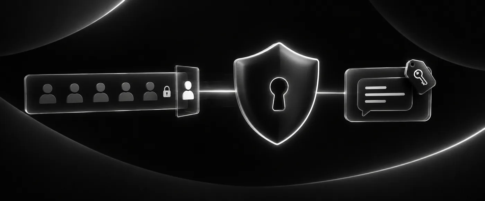
</p>

| | چی |
|:-:|---|
| 👤 | **فقط تو:** فقط `ALLOWED_USER_ID` اجازه‌ی استفاده داره. اگه این مقدار خالی بمونه، ربات دسترسی همه رو رد می‌کنه (fail-closed). |
| 🔑 | **رمز رندوم:** برای هر آرشیو یه رمز ۱۴ کاراکتری با ماژول `secrets` ساخته می‌شه (ثابت نیست). |
| 💬 | **فقط پیش خودت:** رمز فقط توی کپشن همون فایل روی روبیکا نوشته می‌شه که فقط خودت می‌بینی. |
| 🎲 | **اسم رندوم:** فایل‌های موقت روی سرور با اسم تصادفی ذخیره می‌شن. |
| 🧹 | **پاک‌سازی:** بعد از ارسال یا لغو، فایل‌ها از سرور حذف می‌شن. |
| 🙈 | **خطای امن:** به کاربر فقط پیام خطای عمومی نشون داده می‌شه؛ جزئیات (مثل مسیرها) فقط توی لاگ می‌مونه. |

> ⚠️ فایل ‎`.env`، فایل‌های session (‎`*.session`) و `active_sessions.json` (ممکنه شامل رمز آرشیو و مسیر فایل‌ها باشه) هرگز نباید commit بشن. همه‌شون توی ‎`.gitignore` هستن.

---

<a id="recovery"></a>

## 🔄 بازیابی بعد از ری‌استارت

<p align="center">
  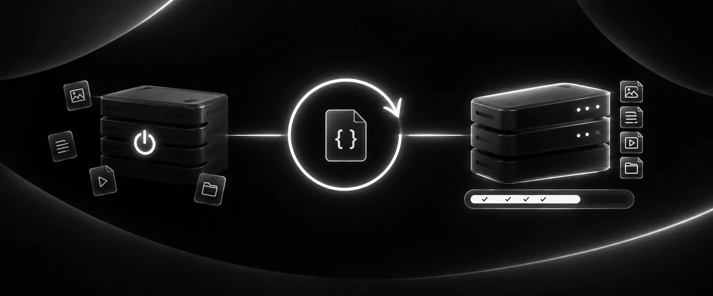
</p>

اگه ربات کرش کنه یا سرور ری‌استارت بشه، لازم نیست همه‌چی رو از اول بفرستی. ربات بعد از هر تغییر مهم (اضافه شدن فایل، شروع ارسال، ارسال موفق هر پارت) وضعیت رو توی `active_sessions.json` ذخیره می‌کنه و موقع بالا اومدن:

- فقط کارهایی که فایل‌هاشون هنوز روی دیسک سالمه بازیابی می‌شن،
- بهت پیام «🔄 ربات ری‌استارت شد» میاد،
- پارت‌هایی که قبلاً موفق رفته بودن **دوباره فرستاده نمی‌شن**.

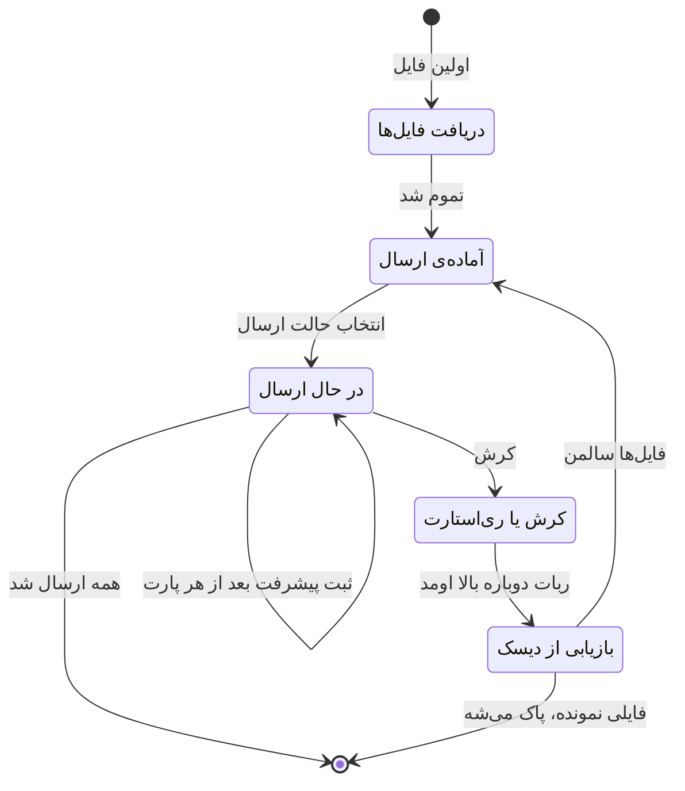

> ℹ️ این مکانیزم «best-effort» هست؛ برای جلوگیری از گم شدن کار توی ری‌استارت‌های معمولیه، نه یه تضمین تراکنشی مثل دیتابیس.

---

<a id="stats"></a>

## 📈 آمار

<table align="center">
  <tr>
    <td align="center">
      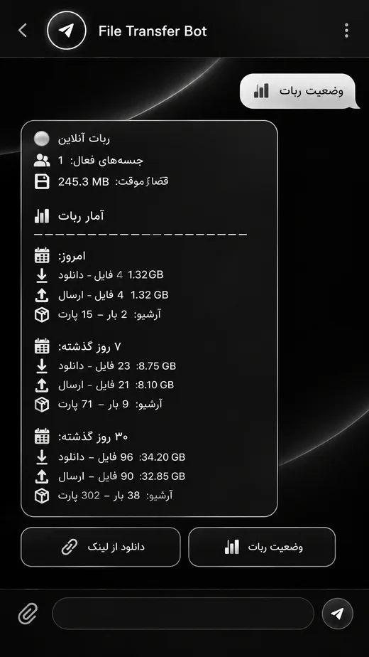<br>
      <sub>دکمه‌ی «📊 وضعیت ربات»</sub>
    </td>
  </tr>
</table>

با دکمه‌ی **«📊 وضعیت ربات»** می‌بینی که ربات آنلاینه یا نه، چند جلسه‌ی فعال داره و چقدر فضای موقت مصرف کرده. بعدش برای **امروز، ۷ روز و ۳۰ روز گذشته** تعداد و حجم دانلودها و ارسال‌ها و تعداد آرشیوها/پارت‌ها میاد. آمار توی یه دیتابیس SQLite (`bot_stats.db`) ذخیره می‌شه.

---

<a id="install"></a>

## 🚀 نصب و راه‌اندازی

<p align="center">
  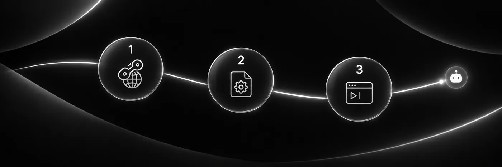
</p>

### پیش‌نیازها

- Python 3.10 یا بالاتر
- حساب تلگرام و یک ربات از [@BotFather](https://t.me/BotFather)
- `API_ID` و `API_HASH` از [my.telegram.org](https://my.telegram.org)
- حساب روبیکا
- ابزار **‎7-Zip‎** روی سرور (برای حالت‌های زیپ و زیپ + رمز): روی اوبونتو/دبیان `sudo apt install p7zip-full`

### ۱. کلون کردن پروژه

```bash
git clone https://github.com/imhamiddev/telegram-to-rubika.git
cd telegram-to-rubika/python-files
```

### ۲. نصب کتابخونه‌ها

```bash
pip install -r requirements.txt
```

### ۳. ساخت فایل ‎`.env`

```bash
cp .env.example .env
```

بعد مقدارها رو توی ‎`.env` پر کن. مقدارهای لازم:

```env
TELEGRAM_TOKEN=توکن_ربات_از_BotFather
TELEGRAM_API_ID=از_my.telegram.org
TELEGRAM_API_HASH=از_my.telegram.org
ALLOWED_USER_ID=آیدی_عددی_تلگرام_تو
```

> 💡 برای گرفتن `ALLOWED_USER_ID` به [@userinfobot](https://t.me/userinfobot) پیام بده.
> اگه برای گرفتن `API_ID` و `API_HASH` مشکل داشتی، توی تلگرام به [@imhamiddev](https://t.me/imhamiddev) پیام بده.

<details>
<summary><b>📋 جدول کامل متغیرهای ‎<code>.env</code></b></summary>

<br>

| متغیر | اجباری | پیش‌فرض | توضیح |
|---|:-:|:-:|---|
| `TELEGRAM_TOKEN` | ✅ | — | توکن ربات از @BotFather |
| `TELEGRAM_API_ID` | ✅ | — | از my.telegram.org (برای دانلود فایل‌های بزرگ) |
| `TELEGRAM_API_HASH` | ✅ | — | از my.telegram.org |
| `ALLOWED_USER_ID` | ✅ | `0` | آیدی عددی تو؛ اگه خالی یا `0` باشه، ربات همه رو رد می‌کنه |
| `TELEGRAM_PHONE` | ➖ | — | شماره با کد کشور (مثل `989123456789`)؛ فقط برای `tg_login.py` لازمه |
| `DOWNLOAD_DIR` | ➖ | ‎`./downloads` | مسیر پوشه‌ی دانلود موقت |
| `MAX_SIZE_MB` | ➖ | `2000` | حداکثر حجم مجاز هر فایل (مگابایت) |
| `SEVENZIP_BIN` | ➖ | خودکار | مسیر `7za`/`7z`، فقط اگه توی PATH یا مسیرهای رایج پیدا نشه |

</details>

### ۴. لاگین روبیکا (فقط یک‌بار)

```bash
python login_setup.py
```

شماره‌ی روبیکات رو با کد کشور وارد کن (مثل `989123456789`) و بعد کد پیامکی رو بزن. یه فایل session ساخته می‌شه و دفعه‌های بعد نیازی به لاگین نیست.

### ۵. اجرا

```bash
python main.py
```

**اجرا در پس‌زمینه:**

```bash
nohup python main.py > bot.log 2>&1 &
```

حالا توی تلگرام به ربات `/start` بده. 🎉

<details>
<summary><b>⚙️ تنظیمات اختیاری</b></summary>

<br>

**مسیر دانلود:** به‌صورت پیش‌فرض پوشه‌ی `downloads` کنار فایل‌های پایتون ساخته می‌شه. اگه می‌خوای مسیر دیگه‌ای باشه (مثلاً هاستی که دیسک جدا داره):

```env
DOWNLOAD_DIR=/home/YOUR_USERNAME/downloads
```

**لاگین یوزراکانت تلگرام (`tg_login.py`):** برای کار عادی ربات لازم نیست. دانلود فایل‌های بزرگ با همون `TELEGRAM_TOKEN` و پروتکل Pyrogram انجام می‌شه و محدودیت ۲۰MB نسخه‌ی HTTP بات‌ها رو نداره. این اسکریپت فقط برای توسعه‌ی قابلیت‌هایی به درد می‌خوره که دسترسی سطح یوزراکانت (نه بات) می‌خوان؛ اگه نیازی نداری، رد شو.

</details>

<details>
<summary><b>📚 وابستگی‌ها</b></summary>

<br>

| کتابخونه | کاربرد |
|---|---|
| `python-telegram-bot` | ربات تلگرام |
| `pyrogram` + `tgcrypto` | دانلود فایل‌های بزرگ از تلگرام |
| `rubpy` | ارسال به روبیکا |
| `yt-dlp` | دانلود از یوتیوب، اینستاگرام و ... |
| `pyzipper` | ابزارهای زیپ رمزدار AES در `rubika_bot.py` |
| `jdatetime` | تاریخ شمسی |
| `python-dotenv` | خواندن فایل ‎`.env` |

به‌علاوه‌ی **‎7-Zip‎** که یه ابزار سیستمیه (نه پکیج پایتون) و آرشیو 7z و پارت‌ها رو می‌سازه.

</details>

---

<a id="architecture"></a>

## 🏗️ معماری

### ساختار فایل‌ها

```
telegram-to-rubika/
├── README.md
├── LICENSE
├── assets/                 # تصاویر و انیمیشن‌های همین صفحه (بهینه‌شده)
└── python-files/
    ├── main.py               # نقطه‌ی شروع برنامه و تنظیم لاگ
    ├── config.py             # خواندن تنظیمات محیطی
    ├── telegram_bot.py       # منطق اصلی ربات تلگرام
    ├── tg_client.py          # دانلود فایل‌های بزرگ از تلگرام
    ├── tg_login.py           # لاگین یک‌بار به اکانت تلگرام (اختیاری)
    ├── login_setup.py        # لاگین یک‌بار به حساب روبیکا
    ├── rubika_bot.py         # ابزارهای ارسال به روبیکا (رمز، نام رندوم)
    ├── downloader.py         # دانلود از لینک (مستقیم و ویدیو)
    ├── stats.py              # ثبت و نمایش آمار
    ├── session_store.py      # ذخیره‌ی وضعیت کارها برای بازیابی
    ├── requirements.txt      # وابستگی‌های پایتون
    ├── requirements-dev.txt  # وابستگی‌های اجرای تست‌ها
    ├── pytest.ini            # تنظیمات تست‌ها
    ├── tests/                # تست‌های خودکار
    ├── .env.example          # نمونه‌ی تنظیمات محیطی
    └── passenger_wsgi.py     # فایل WSGI برای هاست‌های اشتراکی
```

### ارتباط ماژول‌ها

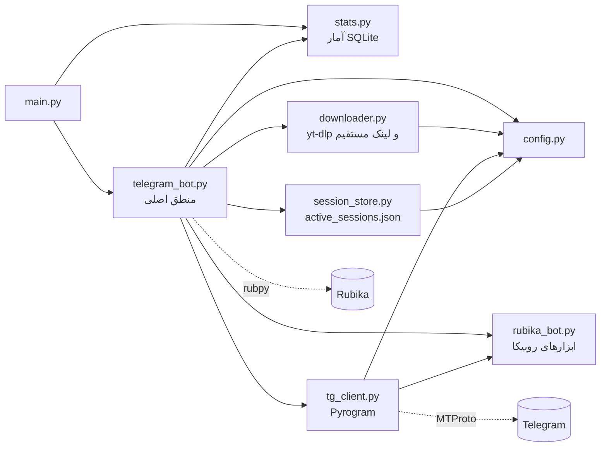

### مسیر یک درخواست

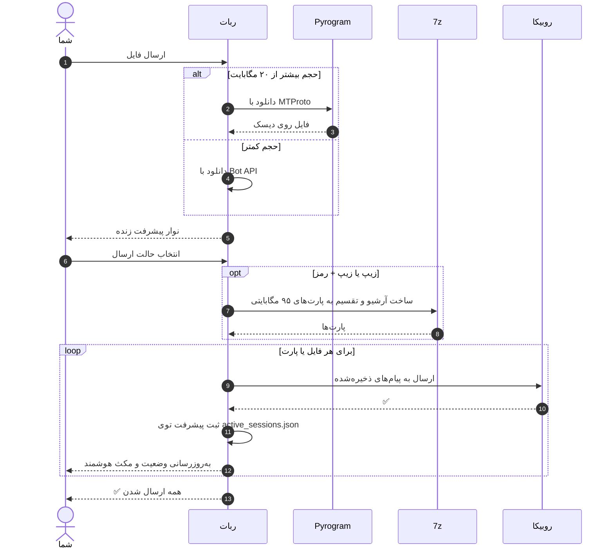

---

<a id="help"></a>

## 🛠️ عیب‌یابی، تست و لایسنس

<p align="center">
  
</p>

<details>
<summary><b>🛠️ عیب‌یابی</b></summary>

<br>

| خطا | راه‌حل |
|---|---|
| `ModuleNotFoundError` | دوباره `pip install -r requirements.txt` بزن |
| ربات جواب نمیده | `ALLOWED_USER_ID` رو چک کن (باید آیدی عددی باشه؛ خالی یا `0` یعنی همه رد می‌شن) |
| خطای session | فایل ‎`.session` رو پاک کن و دوباره لاگین کن |
| `PHONE_NUMBER_INVALID` | شماره رو با کد کشور وارد کن: `989...` |
| مسیر `DOWNLOAD_DIR` مشکل داره | مسیر رو چک کن و مطمئن شو ربات اجازه‌ی نوشتن داره (پوشه اگه نباشه خودکار ساخته می‌شه) |
| «ابزار 7za/7z روی سرور پیدا نشد» | `sudo apt install p7zip-full` بزن یا مسیرش رو توی `SEVENZIP_BIN` بذار |
| «فایل بزرگتر از ... MB هست» | مقدار `MAX_SIZE_MB` رو توی ‎`.env` بالاتر ببر |
| «یک عملیات دیگه در حال انجامه» | صبر کن تا تموم بشه یا ❌ لغو رو بزن، بعد فایل رو دوباره بفرست |
| «session منقضی شده» | فایل‌ها رو دوباره بفرست |
| ارسال وسط کار خطا داد | دوباره دکمه‌ی ارسال رو بزن؛ از همون‌جا ادامه می‌ده و چیزی دوباره فرستاده نمی‌شه |

</details>

<details>
<summary><b>✅ تست‌های خودکار</b></summary>

<br>

```bash
pip install -r requirements.txt -r requirements-dev.txt
pytest
```

برای اجرای تست‌ها به توکن یا اتصال واقعی به تلگرام/روبیکا نیازی نیست. جزئیات بیشتر (چی تست شده، چی نشده و چرا) توی [`tests/README.md`](python-files/tests/README.md) هست.

</details>

<details>
<summary><b>📄 لایسنس</b></summary>

<br>

این پروژه تحت [لایسنس MIT](./LICENSE) منتشر شده؛ استفاده، تغییر و توزیع آزاد است.

</details>

</div>

<div align="center">

<sub>ساخته‌شده توسط <a href="https://t.me/imhamiddev">Hamid</a></sub>


</div>
